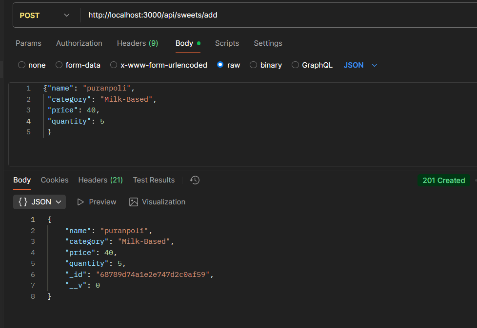
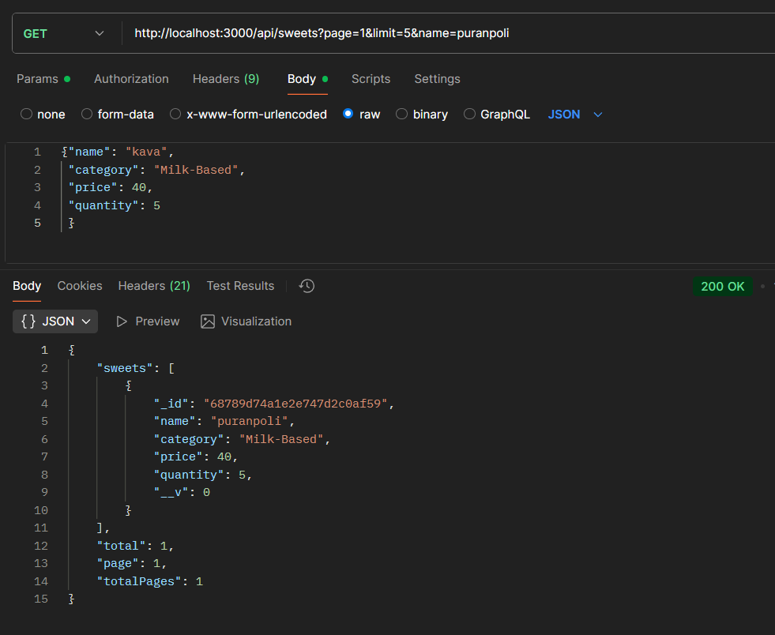
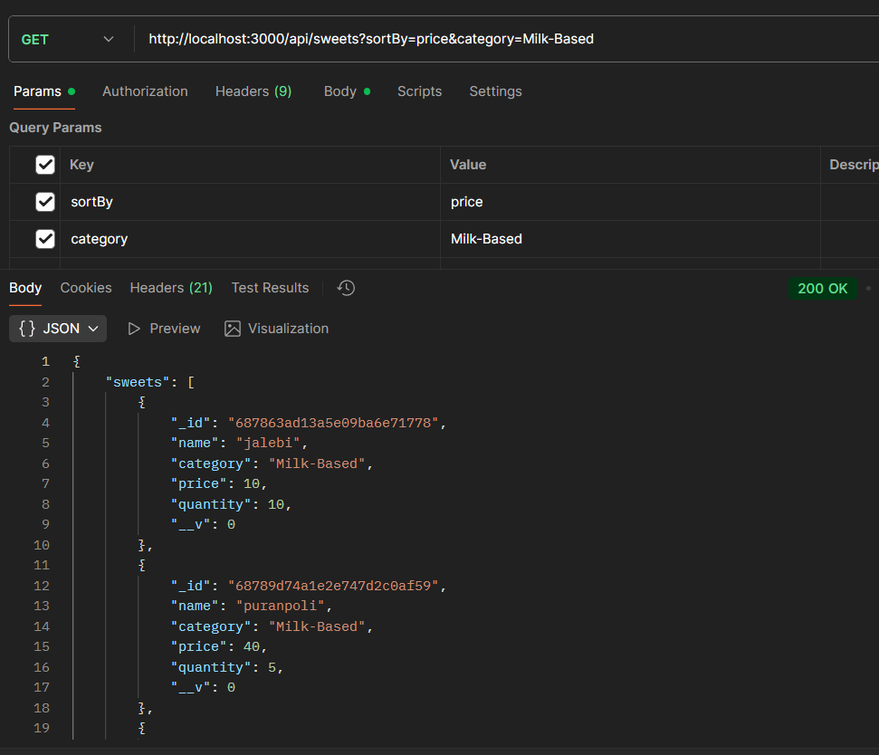
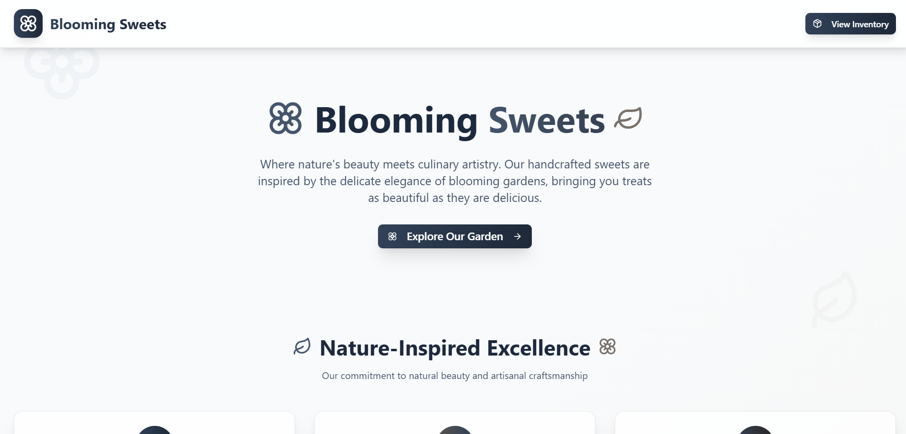

# Sweet Shop Management System

A simple, test-driven Sweet Shop Management System that allows you to perform CRUD operations on sweets, manage inventory, search and sort sweets, and optionally interact with a modern frontend UI.

---

## 🧪 Test-Driven Development (TDD)

This project is built using **TDD principles**:
- Wrote unit and integration tests first using `Jest` and `Supertest`.
- Ensured all functionalities are covered with passing test cases.
- Maintained frequent, meaningful Git commits throughout the development process.

### 🧪 Testing Environment

-To ensure consistency and prevent accidental modifications to production data, we use a separate MongoDB test database during testing. 
-The test database is configured to use a separate MongoDB URI, which is different from the production database URI.
-The test database is not included in the Git repository, and it is created and dropped automatically during testing.

## ✨ Features

###  Core Functionalities
- **Add Sweets:** Add new sweets with name, category, price, and quantity.
- **Delete Sweets:** Remove sweets from the inventory.
- **View All Sweets:** View all available sweets.
- **Search Sweets:** Search sweets by:
  - Name
  - Category
  - Price range
- **Sort Sweets:** Sort sweets by:
  -price
  -quantity
- **oreder data by:** asc or desc based on the selected sort option.
- **Purchase Sweets:** Purchase sweets by ID (with stock quantity checks).
- **Restock Sweets:** Increase the quantity of sweets in inventory.
- **view cart:** view purchased sweets in the cart with total amount, quantity and price.
- **clear cart:** clear the cart.

### 💻 Frontend UI
- Fully responsive UI built with React, TailwindCSS, and ShadCN.
- Add, delete, view, purchase, and restock sweets from the browser.

---

## 🔧 Tech Stack

### Backend
- **Language:** Node.js, TypeScript
- **Framework:** Express.js
- **Database:** MongoDB with Mongoose
- **Testing:** Jest, Supertest
- **Architecture:** MVC with service-layer abstraction
- **Tools:** Postman for API testing, Dotenv for environment management

### Frontend
- **Library:** React
- **Language:** TypeScript
- **Styling:** Tailwind CSS, ShadCN UI
- **State Management:** React Context API
- **API Integration:** Fetch API

---

## 🗃️ Folder Structure

sweet-shop/                          # Root folder
│
├── client/                          # React frontend
│   ├── src/                         # Source folder for React app
│   │   ├── components/              # Reusable UI components
│   │   ├── context/                 # React context (e.g., for state management)
│   │   ├── pages/                   # Page components (e.g., Home, Inventory)
│   │   ├── services/                # API call utilities (e.g., sweetService.ts)
│   │   ├── App.tsx                  # Root React component
│   │   ├── main.tsx                 # Entry point of the React app
│   │   ├── index.css                # Global styles
│   │   └── App.css                  # App-specific styles
│   ├── package.json                 # Client dependencies and scripts
│   ├── package-lock.json            # Lock file for client dependencies
│   └── tsconfig.json                # TypeScript configuration for client
│
├── server/                          # Node.js + Express backend
│   ├── src/
│   │   ├── config/                  # DB config, middleware, etc.
│   │   ├── controllers/             # Express route handlers
│   │   ├── models/                  # Mongoose schemas/models
│   │   ├── routes/                  # API route definitions
│   │   ├── services/                # Business logic layer
│   │   ├── tests/                   # Jest/Supertest test files
│   │   ├── utils/                   # Utility functions
│   │   ├── app.ts                   # Express app setup
│   │   └── server.ts                # Server start file
│   ├── package.json                 # Server dependencies and scripts
│   ├── package-lock.json            # Lock file for server dependencies
│   ├── tsconfig.json                # TypeScript config for server
│   └── .env                         # Environment variables for backend
│
└── README.md                        # Project documentation

---

## 📸 Screenshots

### ✅ Postman API Response Samples

#### ➕ Add Sweet

#### 🔍 Search Sweet By Name

#### 🔍 Search Sweet By price and category

#### 🛒 Purchase Sweet

#### Delete Sweet

#### 🛒 Restock Sweet

---

### 🖼️ Frontend UI Screens

### Homepage

### HomepageFooter

#### 🧁 All Sweets View

#### 🧁 Filter by price and category View

#### ➕ Add Sweet

#### 🛒 Cart Drawer

---